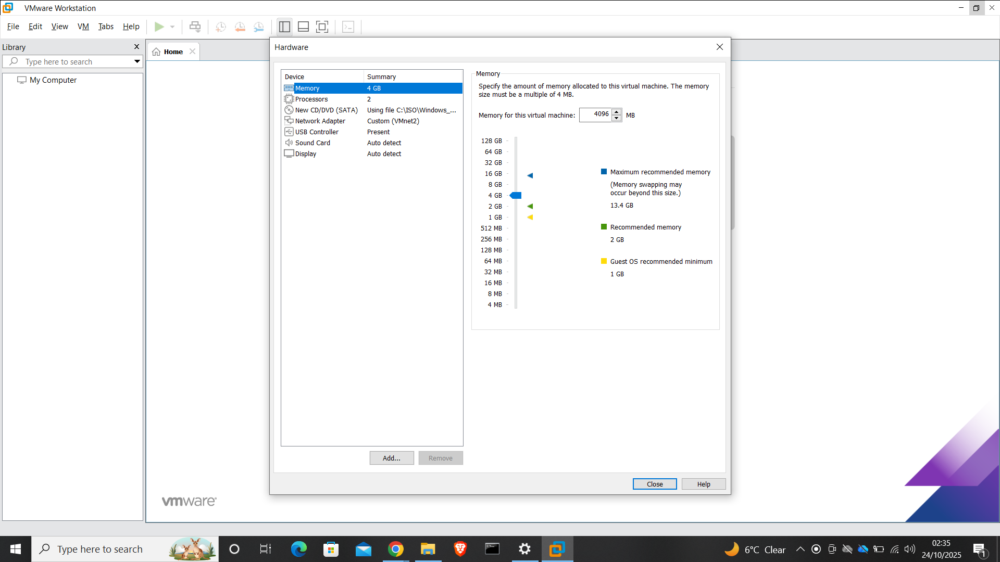

# Phase 2 – Domain Controller Deployment (AD DS + DNS)

This phase focuses on deploying the first server in the lab and preparing it to function as the core identity and name resolution service for the environment.

A correctly configured domain controller is critical, as all authentication, Group Policy, and access control in later phases depend on this system.

---

## Purpose of This Phase

The purpose of this phase is to:

- Deploy a Windows Server virtual machine  
- Configure appropriate hardware resources  
- Assign a static IP address  
- Prepare the server for Active Directory Domain Services (AD DS) and DNS  

---

## Server Overview

- **Server Name:** SD-DC01  
- **Operating System:** Windows Server 2019 Standard  
- **Planned Role:** Domain Controller  
- **Network:** VMnet2 (Host-Only)  
- **IP Address:** 10.88.0.10  

---

## Step 1 – Create the Domain Controller Virtual Machine

A new virtual machine was created in VMware Workstation to host the domain controller.

Hardware resources were allocated to reflect a realistic small-enterprise environment rather than minimal lab settings.

**Configuration applied:**
- Memory: 4 GB RAM  
- Processors: 2 vCPUs  
- Disk: 80 GB (NVMe)  
- Network Adapter: Custom – VMnet2 

**Evidence:**

---

## Step 2 – Configure Network Adapter (VMnet2)

The network adapter was explicitly bound to the Host-Only VMnet2 network created in Phase 1.

This ensures the domain controller operates within an isolated internal LAN and avoids dependency on external networks.

**Evidence:**

---

## Step 3 – Install Windows Server 2019

Windows Server 2019 (Desktop Experience) was installed using an ISO image.

Post-installation validation confirmed:
- Successful boot
- Server Manager loaded correctly
- No installation errors were present

**Evidence:**

---

## Step 4 – Assign Static IP Address

A static IP address was configured to ensure reliable DNS resolution and stable domain functionality.

**IP configuration applied:**
- IP Address: `10.88.0.10`  
- Subnet Mask: `255.255.255.0`  
- Default Gateway: `10.88.0.1`  
- Preferred DNS Server: `127.0.0.1`  

This configuration ensures the server can later host DNS services for the Active Directory domain.

**Evidence:**

---

## Validation Performed

The following checks confirmed the server was ready for domain promotion:

- Server booted without errors  
- Network adapter remained bound to VMnet2 after reboot  
- Static IP configuration persisted  
- Server Manager displayed correct system and hardware information  

---

## Screenshots Included

Only key evidence screenshots are included for this phase:

- Virtual machine hardware configuration  
- Network adapter bound to VMnet2  
- Successful Windows Server installation  
- Static IP configuration on the server  

(Screenshots are stored under:  
[assets/screenshots/phase-2](../assets/screenshots/phase-2/))

---

## Notes and Lessons

Configuring networking and static IP addressing **before** installing Active Directory Domain Services prevents common DNS and domain-join issues later.

This preparation significantly simplifies future phases involving authentication, Group Policy, and client integration.

---

## Next Phase

Proceed to:

- [Phase 3 – Client Build & Configuration](03-Phase-3-Client-Build.md)

