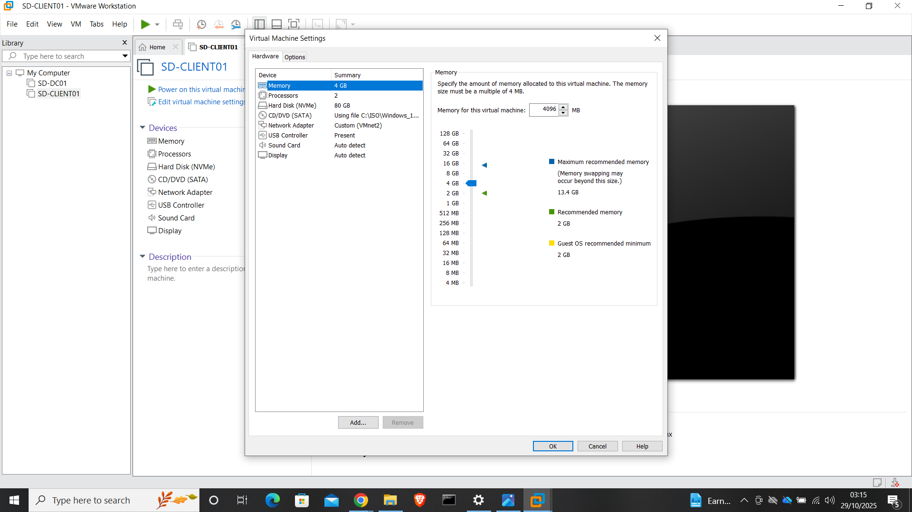
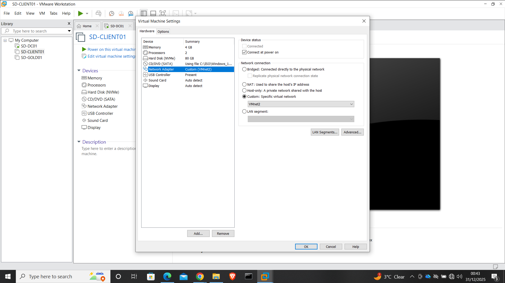

# Phase 3 – Client Build & Configuration

This phase documents the deployment and preparation of the Windows 10 client machine that will later be joined to the Active Directory domain.

The objective of this phase is to build a clean, correctly configured client system that mirrors a typical enterprise workstation before domain integration.

---

## Purpose of This Phase

The purpose of this phase is to:

- Create a Windows 10 client virtual machine
- Allocate appropriate hardware resources
- Connect the client to the internal lab network (VMnet2)
- Install Windows 10 and apply baseline configuration
- Assign a standardised computer name

At this stage, the client is **not yet joined to the domain**.  
The focus is on preparing a stable workstation for domain onboarding in the next phase.

---

## Client Overview

- **Client Name:** SD-CLIENT01  
- **Operating System:** Windows 10 Pro  
- **Role:** Domain-joined workstation (preparation stage)  
- **Network:** VMnet2 (Host-Only)  

---

## Step 1 – Create the Client Virtual Machine

A new virtual machine was created in VMware Workstation to represent a standard user workstation.

Hardware resources were allocated to reflect a realistic enterprise desktop configuration.

**Configuration applied:**
- Memory: 4 GB RAM  
- Processors: 2 vCPUs  
- Disk: 80 GB (NVMe)  
- Network Adapter: Custom – VMnet2  

**Evidence:**

---

## Step 2 – Configure Network Adapter (VMnet2)

The client network adapter was explicitly configured to use the internal Host-Only network (VMnet2).

This ensures the client operates within the same isolated LAN as the domain controller and does not rely on external connectivity.

**Evidence:**

---

## Step 3 – Install Windows 10

Windows 10 Pro was installed using an ISO image.

The installation completed successfully, and the system booted into the Windows desktop environment without errors.

**Evidence:**

---

## Step 4 – Configure Computer Name

The client machine was renamed to follow enterprise naming conventions.

This step was completed before domain join to ensure consistency and avoid renaming issues after domain integration.

**Computer name applied:**
- SD-CLIENT01

**Evidence:**

---

## Validation Performed

The following checks confirmed the client was ready for domain onboarding:

- Windows 10 installed and operational
- Network adapter connected to VMnet2
- Client able to communicate within the lab network
- Computer name correctly applied and persisted after reboot

---

## Notes and Lessons

Preparing the client correctly before domain join simplifies later troubleshooting and avoids rework.

Applying naming conventions and network configuration early reflects real IT support workflows and reduces risk during domain integration.

---

## Screenshots Included

Only key evidence screenshots are included for this phase:

- Client VM hardware configuration
- Network adapter configuration
- Windows 10 installation
- Computer name configuration

Screenshots are stored under: [assets/screenshots/phase-3](../assets/screenshots/phase-3/)

---

## Next Phase

Proceed to:

- [Phase 4 – Client Domain Join & Verification](04-Phase-4-Client-Domain-Join.md)
