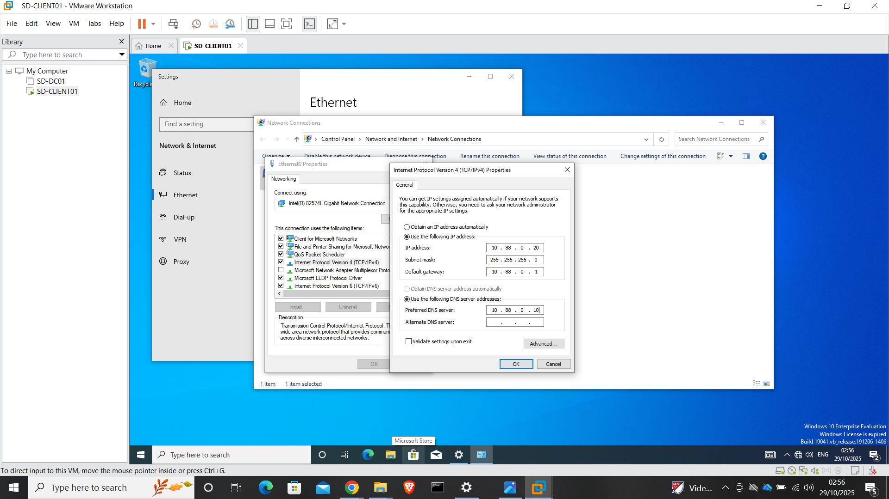
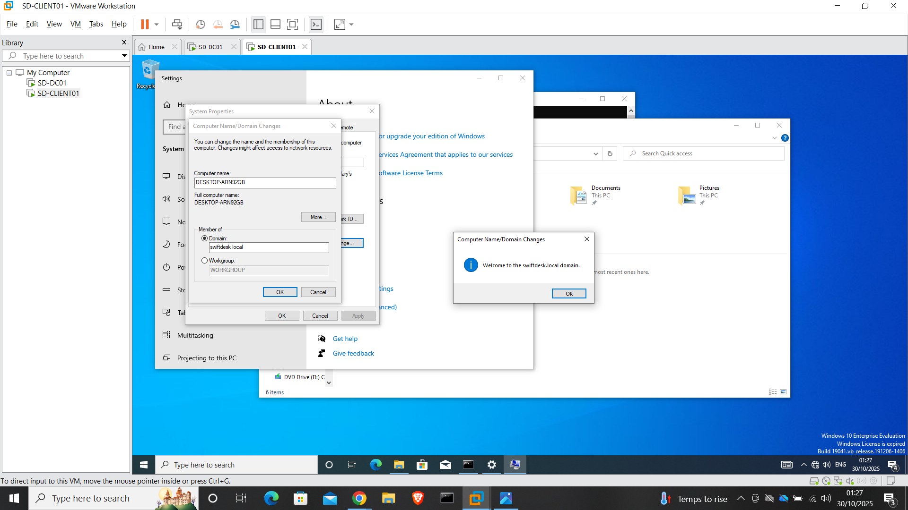

# Phase 4 – Client Domain Join & Verification

This phase focuses on integrating the Windows client into the Active Directory domain created in Phase 2.

Successfully joining the client to the domain confirms that DNS, networking, and authentication services are functioning correctly and that the environment is ready for user management and Group Policy enforcement.

---

## Purpose of This Phase

The purpose of this phase is to:

- Configure client-side DNS to point to the domain controller
- Join the client machine to the Active Directory domain
- Verify domain authentication using a domain user account
- Confirm the client computer object is created in Active Directory

---

## Client Overview

- **Client Name:** SD-CLIENT01  
- **Operating System:** Windows 10 Enterprise  
- **Domain:** swiftdesk.local  
- **Network:** VMnet2 (Host-Only)  
- **IP Address:** 10.88.0.20  
- **DNS Server:** 10.88.0.10 (SD-DC01)

---

## Step 1 – Configure DNS on Client

Before joining the domain, the client’s DNS settings were manually configured to point to the domain controller.

This ensures the client can locate Active Directory and domain services.

**Configuration applied:**
- Preferred DNS Server: `10.88.0.10`
- Alternate DNS Server: (Not set)

**Evidence:**

---

## Step 2 – Join Client to Domain

The client machine was joined to the `swiftdesk.local` domain using domain administrator credentials.

This action registers the client with Active Directory and enables domain-based authentication and policy management.

**Evidence:**

---

## Step 3 – Authenticate Using Domain User Account

After the domain join and reboot, a domain user account was used to log into the client.

This confirms successful communication between the client and the domain controller.

**Evidence:**

---

## Step 4 – Verify Computer Object in Active Directory

The domain controller was checked to confirm that the client computer object was automatically created in Active Directory.

The computer account appeared under the default **Computers** container.

**Evidence:**

---

## Validation Performed

The following checks confirmed a successful domain join:

- Client successfully rebooted after domain join  
- Domain credentials authenticated correctly  
- Client logged in using a domain user account  
- Computer object visible in Active Directory  

---

## Screenshots Included

Only key evidence screenshots are included for this phase:

- Client DNS configuration  
- Domain join confirmation  
- Domain user authentication  
- Active Directory computer object verification  

Screenshots are stored under: [assets/screenshots/phase-4](../assets/screenshots/phase-4/)

---

## Notes and Lessons

Correct DNS configuration on the client is critical.  
If DNS is misconfigured, domain joins will fail even if networking appears functional.

This phase validates that the core Active Directory infrastructure is stable and ready for user, group, and policy management.

---

## Next Phase

Proceed to:

- [Phase 5 – Users, Groups & OU Structure](05-Phase-5-Users-Groups-OU.md)
