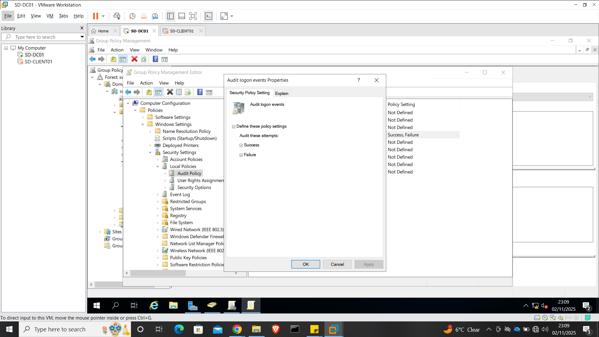

# Phase 7 – Departmental Group Policy Objects (GPOs)

This phase documents the implementation and validation of **department-specific Group Policy Objects (GPOs)** within the SwiftDesk Active Directory environment.

Group Policy was applied per department to reflect real enterprise environments, where different teams have different security and operational requirements.

---

## Purpose of This Phase

The purpose of this phase is to:

- Apply tailored desktop and security policies per department
- Enforce least-privilege access based on role
- Standardise user environments
- Reduce support overhead through centralised policy management
- Validate policy application from both system and user perspectives

---

## Departments Covered

- Human Resources (HR)
- Information Technology (IT)

Additional departments (Finance, Sales, Management) will be implemented in future iterations.

---

## Group Policy Design Approach

Each department has its own **dedicated GPO**, linked at the OU level.

This approach:
- Prevents policy overlap
- Simplifies troubleshooting
- Improves change control
- Reflects enterprise Active Directory best practices

---

# HR Department Group Policy

## HR Policy Overview

- **GPO Name:** `HR_Policy`
- **Linked OUs:** HR, HR-WS
- **Design Model:** Restrictive-by-default

---

## HR – Step-by-Step Implementation

### Step 1 – Create and Link HR Policy

The `HR_Policy` GPO was created and linked to the HR OU using Group Policy Management.

**Evidence:**

---

### Step 2 – Restrict User Environment

HR users were restricted from accessing Control Panel and system configuration tools.

**Evidence:**

---

### Step 3 – Configure Folder Redirection

The Documents folder was redirected to a central server location.

**Evidence:**

---

### Step 4 – Configure HR Drive Mapping

HR shared drive mapped automatically at user logon.

**Evidence:**

  

---

### Step 5 – Enforce Session Security

Automatic screen lock configured.

**Evidence:**

---

### Step 6 – Block Removable Storage

USB and removable storage blocked.

**Evidence:**

  

---

### Step 7 – Enable Logon Auditing

Logon auditing enabled.

**Evidence:**

---

### Step 8 – Validate HR Policy Application

Policy application validated using system and client-side checks.

**Evidence:**

---

# IT Department Group Policy

## IT Policy Overview

- **GPO Name:** `IT_AdminPolicy`
- **Linked OUs:** IT, IT-WS
- **Design Model:** Admin-enabled, controlled access

---

## IT – Step-by-Step Implementation

### Step 1 – Create and Link IT Policy

The IT policy was created and linked to the IT OU.

**Evidence:**

---

### Step 2 – Configure Administrative Settings

Administrative settings were configured within the IT policy.

**Evidence:**

---

### Step 3 – Grant Local Administrator Rights

IT users were added to the local Administrators group using Restricted Groups.

**Evidence:**

---

### Step 4 – Enable Remote Desktop Access

Remote Desktop was enabled for IT support activities.

**Evidence:**

  

---

### Step 5 – Provide Administrative Tools

Administrative tools were made available to IT users.

**Evidence:**

---

### Step 6 – Validate IT Policy Application

Policy application validated using `gpresult`.

**Evidence:**

---

## Screenshots Included

Screenshots for this phase are stored under:

- `assets/screenshots/phase-7/HR`
- `assets/screenshots/phase-7/IT`

---

## Notes and Lessons

Implementing Group Policy per department:

- Improves security and control
- Simplifies troubleshooting
- Reflects enterprise Active Directory design
- Supports scalable growth

---

## Future Work

The following departments will be implemented in future iterations:

- Finance
- Sales
- Management

---

## Next Phase

Proceed to:

- **Phase 8 – Troubleshooting Scenarios**  
  `docs/08-Phase-8-Troubleshooting.md`
