# Phase 7 – Departmental Group Policy Objects (GPOs)

This phase documents the implementation and validation of **department-specific Group Policy Objects (GPOs)** within the SwiftDesk Active Directory environment.

Group Policy is applied per department to reflect real enterprise practice, where different teams operate under different security and operational controls.

---

## Purpose of This Phase

The purpose of this phase is to:

- Apply desktop and security controls by department
- Enforce least-privilege access
- Standardise user environments
- Reduce manual configuration on client machines
- Validate policy application from both system and user perspectives

---

## Departments Implemented

The following departments are implemented in this phase:

- Human Resources (HR)
- Information Technology (IT)

Other departments (Finance, Sales, Management) are planned for future iterations.

---

## Group Policy Design Approach

Each department uses its **own dedicated GPO**, linked directly to the relevant Organisational Unit (OU).

This approach:
- Prevents policy overlap
- Simplifies troubleshooting
- Improves change control
- Aligns with enterprise Active Directory best practices

---

# HR Department Group Policy

## HR Policy Overview

- **GPO Name:** `HR_Policy`
- **Linked OUs:** HR, HR-WS
- **Design Model:** Restrictive-by-default

The HR policy prioritises data protection, consistency, and reduced system access.

---

## HR – Configuration Steps

### Step 1 – Create and Link HR GPO

The `HR_Policy` GPO was created in Group Policy Management and linked to the HR OU.

**Evidence:**  
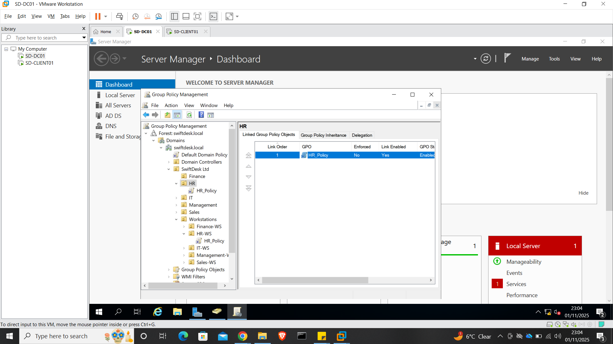

---

### Step 2 – Restrict User Environment

Control Panel and system configuration tools were restricted for HR users.

**Evidence:**  
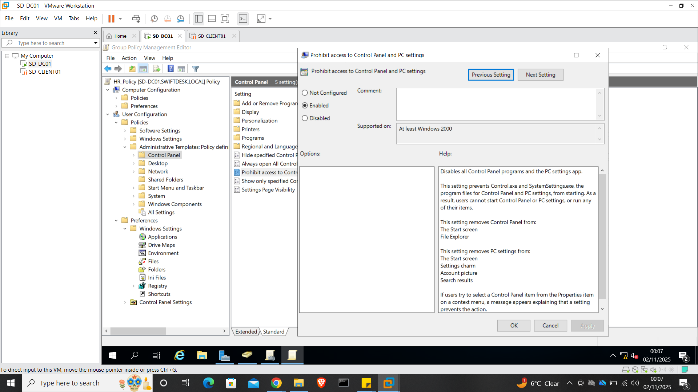

---

### Step 3 – Configure Folder Redirection

The Documents folder was redirected to a central server location to protect HR data.

**Evidence:**  
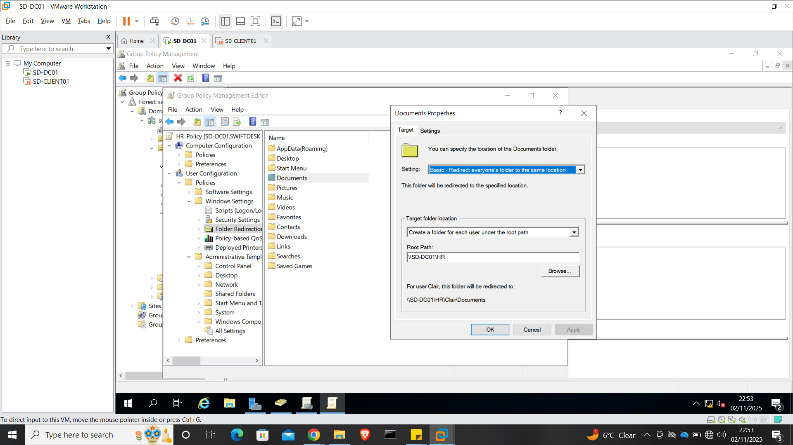

---

### Step 4 – Configure HR Drive Mapping

An HR shared drive was mapped automatically at user logon.

**Evidence:**  
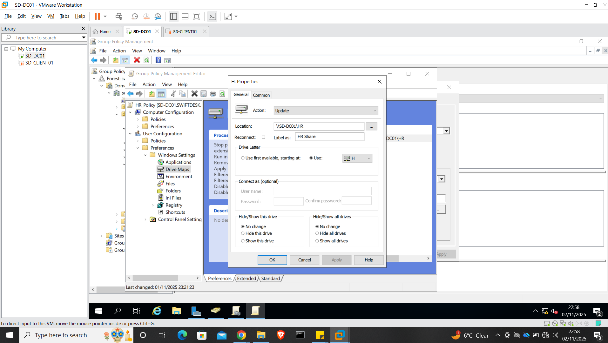

---

### Step 5 – Enforce Session Security

Automatic screen locking was configured to protect unattended workstations.

**Evidence:**  
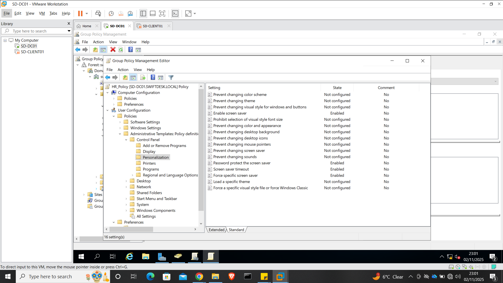

---

### Step 6 – Block Removable Storage

USB and removable storage access was blocked.

**Evidence:**  

---

### Step 7 – Apply and Verify HR Policy (System-Level)

Policy application was enforced and verified:

- `gpupdate /force`
- User logoff and logon
- `gpresult /r` confirmed policy scope

**Evidence:**  
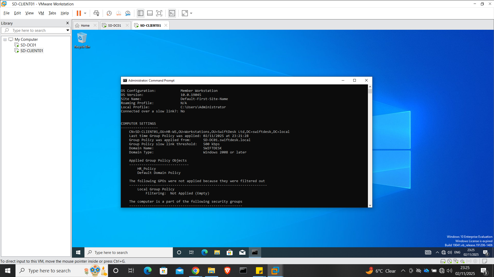

---

### Step 8 – Validate HR Client-Side Behaviour

Logged in as an HR user and confirmed:

- HR drive mapped successfully
- Documents redirected to server
- Control Panel access blocked
- USB access denied
- Screen lock enforced

**Evidence:** 

### HR drive mapped successfully
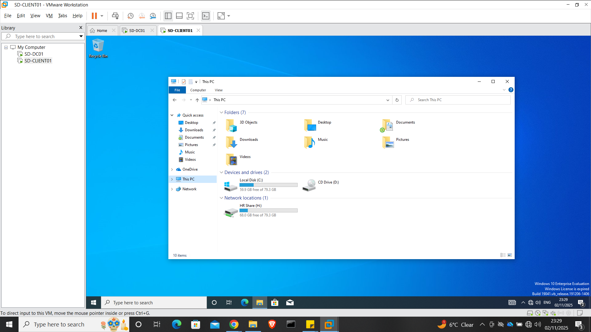 

### USB access denied
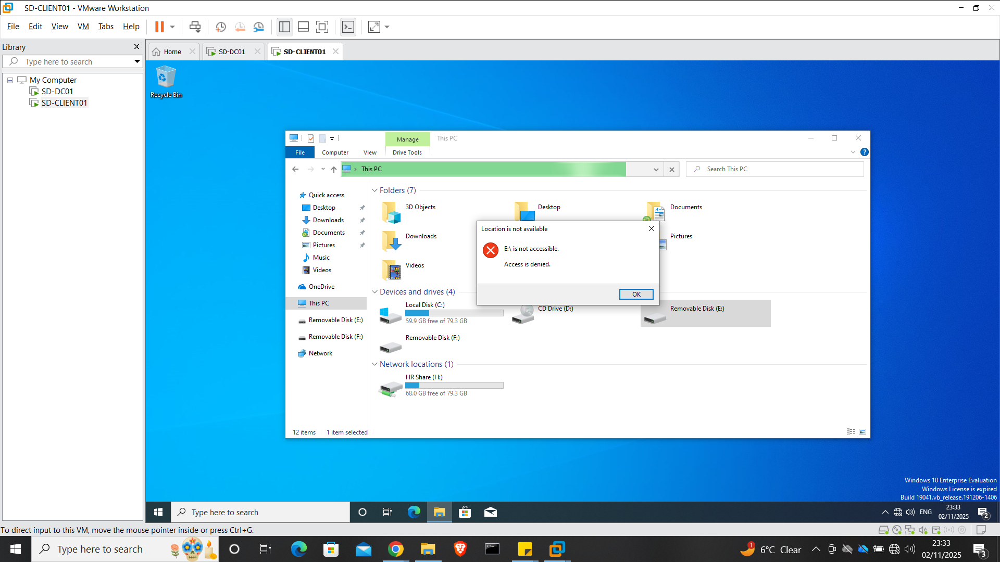

---
---
---
---
---
---
---
---
---
---

# IT Department Group Policy

## IT Policy Overview

- **GPO Name:** `IT_AdminPolicy`
- **Linked OUs:** IT, IT-WS
- **Design Model:** Admin-enabled, controlled access

The IT policy enables support functionality while maintaining governance.

---

## IT – Configuration Steps

### Step 1 – Create and Link IT GPO

The IT policy was created and linked to the IT OU.

**Evidence:**  
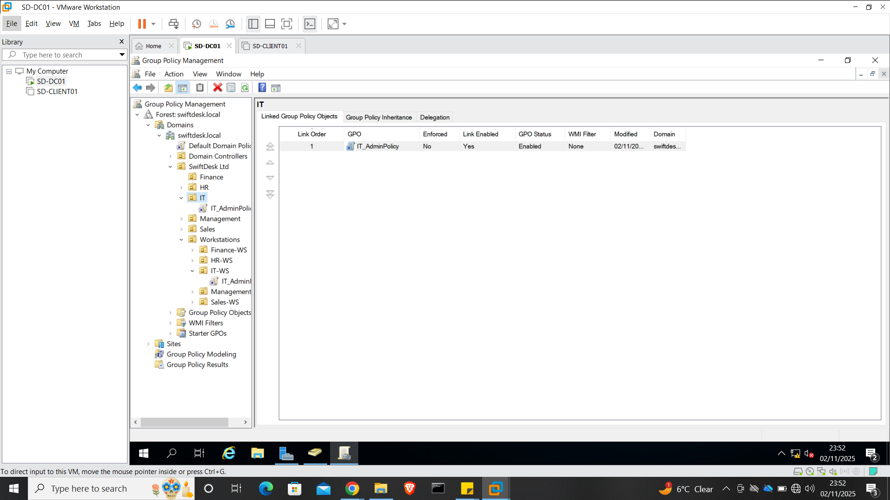

---

### Step 2 – Configure Administrative Settings

Administrative settings were configured within the IT policy.

**Evidence:**  
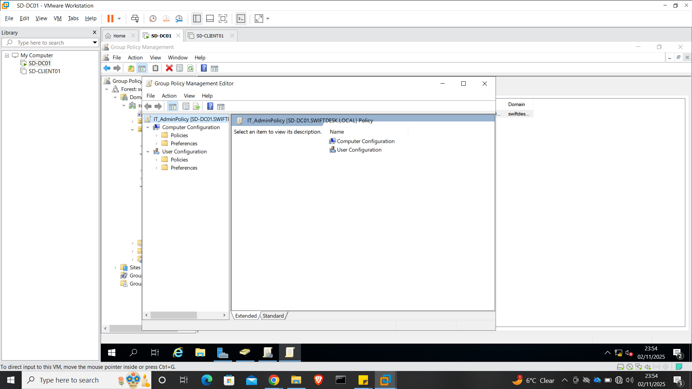

---

### Step 3 – Assign Local Administrator Rights

Restricted Groups were used to assign IT users local administrator rights.

**Evidence:**  
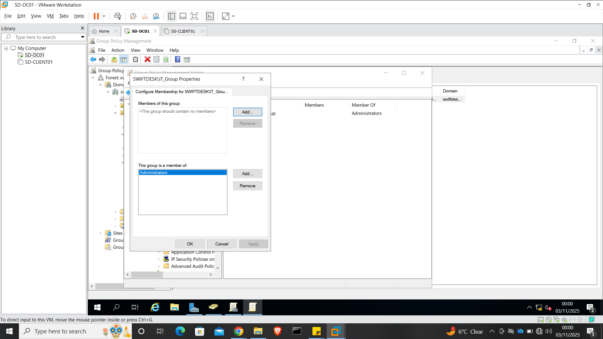

---

### Step 4 – Enable Remote Desktop

Remote Desktop access was enabled for IT support operations.

**Evidence:**  
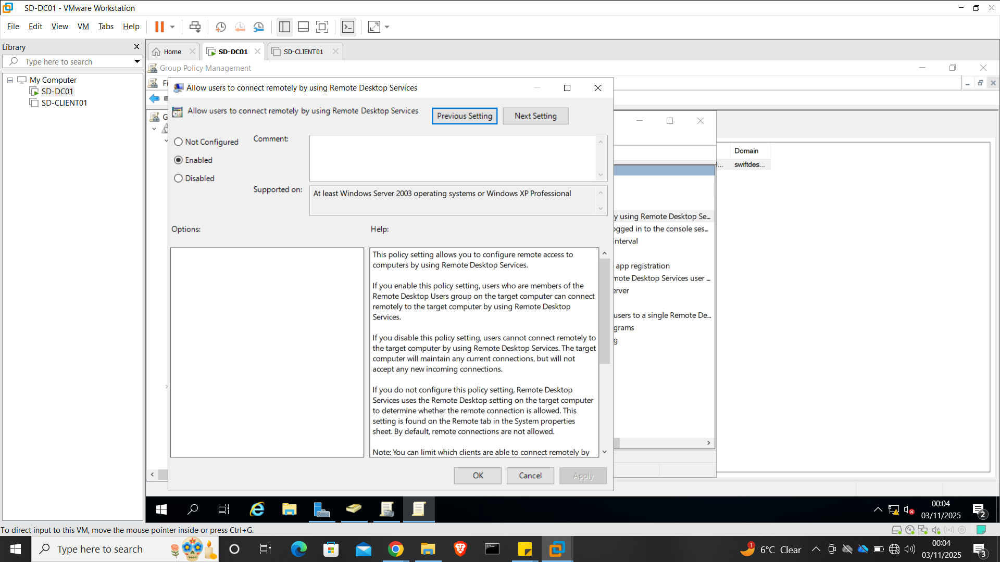

---

### Step 5 – Provide Administrative Tools

Administrative tools and shortcuts were made available for IT support tasks.

**Evidence:**  
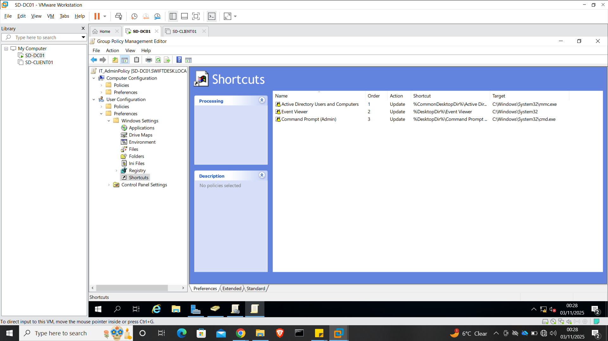

---

### Step 6 – Configure IT Desktop Wallpaper

A wallpaper policy was applied to standardise the IT desktop environment and visually distinguish IT-managed systems.

**Evidence:**  
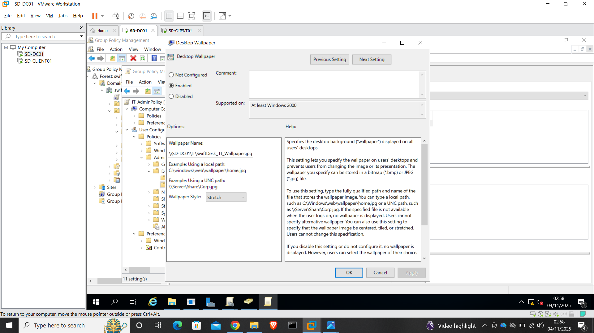

---

### Step 7 – Apply and Verify IT Policy (System-Level)

Policy application was enforced and verified:

- `gpupdate /force`
- User logoff and logon
- `gpresult /r` confirmed policy scope

**Evidence:**  
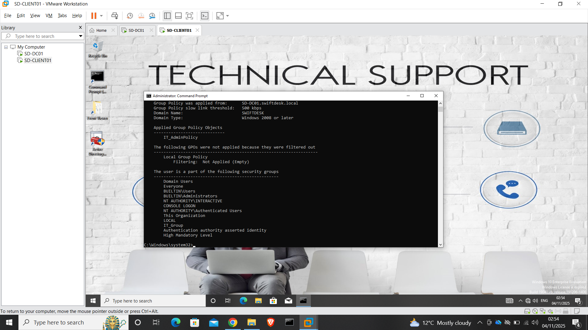

---

### Step 8 – Validate IT Client-Side Behaviour

Logged in as an IT user and confirmed:

- Local administrator privileges applied
- Administrative tools available
- Desktop wallpaper applied as expected
- Remote Desktop connection successful
- Policy persisted after reboot

**Evidence:**  

### Desktop wallpaper applied as expected and Administrative tools available
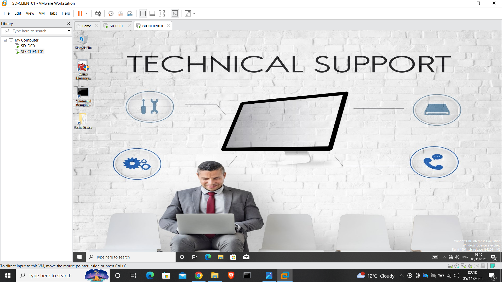 

### Remote Desktop connection successful

---

---

## Screenshots Included

Evidence for this phase is organised by department:

- **Human Resources:**  
  [View HR GPO Screenshots](../assets/screenshots/phase-7/HR)

- **Information Technology:**  
  [View IT GPO Screenshots](../assets/screenshots/phase-7/IT)

---

## Notes and Lessons

Separating Group Policy by department:

- Improves security posture
- Simplifies administration
- Makes troubleshooting faster
- Reflects real enterprise Active Directory design

---

## Future Work

The following departments will be implemented in future iterations:

- Finance
- Sales
- Management

---

---

## Next Phase

Proceed to:

- [Phase 8 – Troubleshooting Scenarios](08-Phase-8-Troubleshooting.md)
